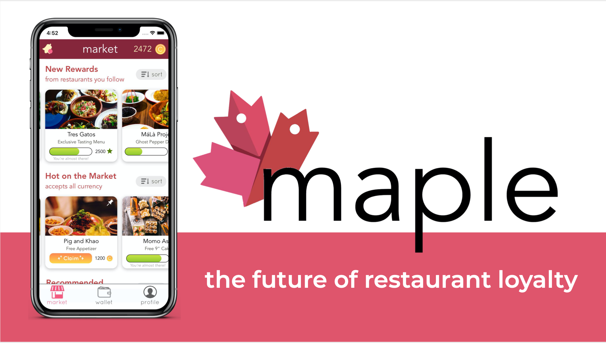

# Project prototype demos 

###### Caitlyn Chen

> The portfolio section on my personal website https://caitlynchen.com will be launched soon!  
> For now I'll share some design prototypes of various projects I've been working on recently: 

## Table of Contents
1. [FoodFinds](#FoodFinds)  
  a. [Initial branding](#FoodFinds)  
  b. [After rebranding](##Rebranding)
2. [Maple](#Maple)
3. [Supercharged](#Supercharged)

# FoodFinds

 

FoodFinds is an app that allows college students to share extra food items with peers. 

FoodFinds seeks to address issues of food waste and food insecurity in a feel-good way, eliminating discomfort users may feel from revealing to their peers that they need an extra meal swipe or would be willing to take food items their peers had given away. To ameliorate any discomfort, in addition to anonymity support, the users who provide "supply" on the app will be the ones to take initiative, and be the ones to make requests for getting leftover meal swipes or snack items getting taken off their hands, while users who represent "demand" on the app will be the ones to respond to those requests. In essence, FoodFinds is turning the tables on any stigma that may have resulted from a user having to reach out to another user to get free food, by flipping the direction of that exchange. 

FoodFinds is an app meant to used by college students looking to give away their unused meal swipes for the week, get the latest scoop on free food opportunities, find out where on campus to grab snacks, or even meet up with a potential new friend and receive a yummy food item as the icing on top. Our motto: don't let food go to waste! eat and share free food around campus!

### Brainstorming Process

<table>
  <tr>
    <td>
      
    </td>
    <td>
      
    </td>
    <td>
      
    </td>
  </tr>
</table>

Currently, Foodfinds is in its second user-centered design (UCD) loop. Across ~10 user research interviews gathered so far, the major risks that have been identified and tackled were people feeling uncomfortable with getting food from others due to stigma surrounding food insecurity issues and differentiating Foodfinds from existing platforms like Sharemeals, Olio, and Facebook marketplace. The risk that still needs to be tackled is incentivizing people to be active on the platform and share food opportunities, whether thhat will involve a sharer-to-receiver review system or visualizations (either in the form of a percentage or points that will convert to badges) of carbon emissions  reduced from food that would have gone to waste. Once again, in making sure that using Foodfinds doesn't feel like an act of charity in giving food to peers in need, Foodfinds's brand values aren't about doing social good for peers, but about doing environmental good for the planet and for the food itself that would have otherwise gone to waste. 

I plan to implement FoodFinds in SwiftUI after getting the Figma prototype to a state where all aspects of the app's core functionality is well represented. I'm excited to revisit the language after the most recent updates since I last used it over the summer!

### Prototyping Process

<table>
  <tr>
    <td>
      
    </td>
    <td>
      
    </td>
  </tr>
</table>

### Figma File 

Setting up the design system so that it had the feel of a real iOS app and so that I could reuse components definitely took quite a bit of time! One of the most time consuming challenges was actually getting the dimensions of items to be consistent in scale and ensuring that items in a group had the same positioning and alignment (I wish that Figma had Adobe XD's grid drag thingy!). I also used horizontal scrolling for the first time in Figma (I've had more experience previously using Adobe XD and Invision Studio). I used a bunch of icons I found in the Figma community, and started laying out FoodFind's color palette as well. As with my paper prototype (that I had drawn in Notability on my iPad), I decided to go with a light blue as the main theme color, which is quite fitting, as light blue is Columbia University's color, and FoodFinds is meant to be used by Columbia students (before potentially expanding to other college campuses). I wanted the app to feel warm and inviting, yet sleek and clean, with some minimalistic feel. 

Right now the first thing that users will see when they open the app is the main feed in the Discover tab. Right now the model is centered aroudn the belief (with backing from user research interviews so far, but will need to continue validating this), that users will prioritize seeing live updates on food being shared vs. checking their notifications/lists of pantries on which items got recently placed into their go-to pantries. Will also need to continue fleshing out the user workflows for pantry drop-off, 1:1 meetup exchange, meal swipe share, etc.

Upcoming screens that need to be prototyped:
- Pantry inventory screen
- Profile screen (+ review section, badges section)
- Chat screen & individual chat screens (move chat icon to upper right corner to make room for bookmarked/shortlist tab on tabbar)
- New bookmark/shortlist screen
  - the user can "shortlist" their favorite pantries and be able to access the inventory details from there. This solves the issue of not having a permanent list of pantries to reference to in the list view of the main feed. 
  - ^ but only would have about 10 pantries on campus (1 per dorm), so not make as much sense to have to bookmark -- currently exploring other ways of better incorporating a more consolidated list of pantries (can have both the list and map views act as entry points to the pantry inventory view)
- Create new post screen
  - for pantry, ways to indicate which specific pantry placing item into / different text associated with it from caption + image
  - ^ perhaps it would be better to have an option in the create post screen for which type of post the user wants to create first, and the app can provide them with a template / specific fields that need to be filled out
- Activity screen (with location radius toggle bar)

Smaller things:
- put search bar above filters, collapse list/map toggle and set location when scroll up
- sort button / drop down (sort by location, time of freshness (default is time of posting), etc.)
- ability of user to post multiple pics, and to swipe through pics in given post gallery style
- login / signup screens
- onboarding / walkthrough tutorial screens 
- drop down menu for filter button in main feed
- (tentative) Columbia / Barnard campus toggle in map view (but user can just change their location themselves as well)
- color-coded pins on map that also indicate time urgency of food (items with smaller time windows of freshness & if the sharer has limited time to get the food item off of their hands)
- different colored nav bars (based on tab selected)
- faq's screen
- (tentative) where to place search bar <-- still kind of need this, but placement is awkward given the current layout of the ui

<table>
  <tr>
    <td>
      
    </td>
    <td>
      
    </td>
    <td>
      
    </td>
  </tr>
</table>

### Walkthrough of App so far Gif

 

## Rebranding

The goal of the rebrand was to make the app more inviting and be more reminiscent of food. I chose to go with an orange color palette with violet gradient accents for buttons. The goal was also to do away with any more feelings of discomfort that users may feel in using the app to search for free food opps, by creating a warm, foodie atmosphere. 

Here are the iconsets and color palettes that helped shape the new brand vision of FoodFinds:

New look of the list view in the feed screen:

To resolve the longstanding question of how to best organize and present the data on the four different types of food postings -- meal swipes, food left over from club events, 1:1 food meetups, and pantry drop offs -- a toggle tabbar replaced the filter toggles in the main feed screen so that the user could toggle between different views of postings and expect to receive different types of information when they navigate between toggles, rather than get aggregated postings within the same list view. 

For meal swipe sharing, in this model, meal swipe requests and shares will be done in real time, rather than say, postings at 2pm about going to the dining hall at 7pm with meal swipes to share. This way, meal swipe shares will be both more convenient for the user and be more guaranteed (a user who's sharing a meal swipe will first "check in to the dining hall" based on their location, and then indicate the time window for which they will be open to swiping other people in, presumably as long as the duration of their meal lasts. The app will directly match people who press the request button and people who press the share button in the meal swipe view and notify each person, so that neither party has to do the reaching out, which was the case in the previous model.

For more spontaneous postings like posts about extra food left over from club events or about food items they would want to give away in a physical meetup rather than drop it off in a pantry, those types of posts would both fall under the live social media feed type postings umbrella, and basically look identical to the ui of postings in the old model. The club event type postings have been prototyped, and the food item exchanges (the og type post that FoodFinds was originally meant to center on, anyway), would look more or less the same, but with more information on the sharer's preferred form of contact to coordinate the 1:1 meetup / pickup, as dm'ing is the most necessary for this use case out of the different use cases.

For the pantry problem, in this model when a user clicks into a pantry card in either the list view or map view, they are presented with a popup that fills up the whole screen with the pantry inventory details (like in Google Maps). 

Change from filter toggles to toggle tabbar:

<table>
  <tr>
    <td>
       ➡️
    </td>
    <td>
      
    </td>
  </tr>
</table>

New look of list view screen with the new organization of data under the toggle tabbar model:

Side by side comparisons of current, rebranded FoodFinds feed screen with the previous, Columbia light blue minimalistic branding:

<table>
  <tr>
    <td>
       
    </td>
    <td>
      
    </td>
  </tr>
</table>

### Rebranded Walkthrough of App Gif

 

### Features that still need to be prototyped

* [ ] pantry toggle view
* [ ] meal swipe shares toggle view
* [ ] meal swipe notification type shares, view that pops up when click into button
* [ ] pop up when click into pantry (both map view and list view)
* [ ] new map view, styling of cards in carousel 
* [ ] under username in post, we have their location, pin icon, connect to map view version
* [ ] where to put address of location in carousel card in map view
* [ ] get rid of create button icon in tabbar, either have floating button model or blank field to create a post as the first item in the list of posts in the feed views
* [ ] create post screen (different views depending on which type of post the user indicates)
* [ ] profile screen: add in toggle views, other insights of profile activity, summary of data,  shared with x people, etc., reviews of users 
* [ ] edit activity screen to either have carbon emission reduced percentage info if we want to place more emphasis on the environmental aspect -- otherwise, edit to place less emphasis on the environmental aspect as on the sharing good food and cheer with peers (the environmental component seems kind of like an add-on to the current branding, not sure how much of it would want to incorporate going forward
* [ ] edit login screen to fit in with the branding style more (warm, foodie, playful), have interactions for both the username and passcodes fields filled out when click into both of those fields
* [ ] edit chat screen ui to fit in more with the branding style, make more orange, _warm_
* [ ] Put search bar above toggle tabbar, collapse list/map toggle and set location when scroll up (get rid of list/map toggle bar), and also having more sort/filter options
* [ ] Allergies / Dietary restrictions screen when first onboarding so that posts with potential allergens are marked by the app when shown to the user
* [ ] Display both examples of posts that are expired and posts that are expiring soon (whether or not to show that fully in the feed or disappear after a certain amount of time?)
* [ ] implement in SwiftUI
* [ ] other Easter egg / holiday advent calendar surprises like current donut when no more posts to load (love the Yelp pull down rocketship animation)

Definitely a lot to prototype and do -- need to make sure that there are 1 or more complete user stories on the app!

### Figma Demo
https://www.figma.com/proto/8JCJtpVgMyXwazvPNQrqum/Fig?node-id=6%3A6&scaling=scale-down

------------------------
# Maple

 

🍁 Maple is a social reward platform where users can use points from one restaurant to claim a reward from another, for a premium. More than any loyalty program hub or dining rewards program, this elegant solution has the power to simultaneously nurture meaningful relationships with regulars and offer the flexibility that variety-minded diners desperately crave.

### Brainstorming process 

I worked on Maple over the summer as part of ORIGIN, an entrepreneurship bootcamp program. I was essentially a jack of all trades -- I was product lead, frontend lead, finance lead, and worked on much of the ideation and design prototyping as well. Maple was my first experience in working on a startup from ideation phase. As my product management internship at Mastercard had concluded by July, I was working full time on Maple alongside my teammates and we had many sleepless nights where we kept ideating and debating about pivots. All in all, Maple was the result of 3 pivots, more than 50 user survey responses, more than 40 user interviews, and 10 wireframe testing sessions. Maple got me really excited about entrepreneurship when it comes to bringing an idea to life, designing for the users, and pitching a startup idea. I'm excited to learn more about the business development side of things when it comes to bringing a product in front of stakeholders and acquiring customers.

### Development process

Building the MVP for Maple was also my first time using SwiftUI. As SwiftUI is still a relatively new language, a large part of the challenges came from implementing certain methods that were not supported. For example, when dragging the horizontal carousel view, the ability to have the current card in view slow down and "snap" into place, rather than whizzing past at the same speed as the other cards in the carousel:

Code snippet:

### Screenshots of some screens

<table>
  <tr>
    <td>
      
    </td>
    <td>
      
    </td>
    <td>
      
    </td>
  </tr>
</table>

Design prototyping for Maple was done primarily in Adobe XD, as well as during the development process itself. The entirety of the profile screen was prototyped in SwiftUI without preliminary design prototyping, as was part of the Market View tab (first screen), as well as the point distribution popup in the Restaurant View.

### Walkthrough of App so far Gif

<table>
  <tr>
    <td>
      
    </td>
    <td>
      
    </td>
  </tr>
</table>

# Supercharged 

 

Target Problem: Connecting with and meeting people for professional intentions of building out your network through 1:1 interactions is very time consuming in terms of figuring out who you want to connect to, before cold emailing or messaging them on LinkedIn, and then spending time on back and forth emails in order to schedule a coffee chat. And sometimes, after going through all that effort, the conversation doesn’t turn out to be that meaningful or helpful for you anyway. Additionally, with everything being virtual now, it’s difficult to have spontaneous interactions with acquaintances or with people who you usually run into often on campus but haven’t yet gotten a chance to know well. 

Within this larger problem, I focused on the problem of attending virtual events where a lot of the attendees are like-minded people and then never being able to really connect with them after the event is over. Usually in person, attendees would have the chance to meet each other at events, but that is not very possible with virtual speaker panel events, fireside chats, and webinars held over platforms like Zoom.

Supercharged seeks to provide event attendees with a chance to network after the conclusion of an event. Because it’s a wide pool of people, the platform will pair each person with another person for quick, speed rounds of 1:1 coffee chats. And after the initial networking sessions, there will also be other opportunities to network within the same group – users can select time preferences and choose to opt in for a potential additional networking event, and if there are enough interested people, then the platform will organize another networking session. In this way, people can easily meet each other and will likely have some point of common interest, given that they attended an event together. There is no scheduling hassle and no back and forths – the platform will do all the coordination for you.

### Brainstorming Process

Supercharged actually started out as a personal CRM. Keeping track of my own professional network and growing relationships were pain points that I personally felt. However, after doing research on exisiting platforms (both ones that are currently active and ones that are inactive), I quickly realized that those personal CRM solutions were mainly centered around notifying the user to reach out to people, based on the user's settings of which people they wanted to prioritize in their network and when people's birthdays were. There was only so much that the platform could do -- while those personal CRM platforms had the functionality typical of a CRM in storing the previous history of contacts with a given person, most of the settings that affected how the user got prompted from the app to reach out were manually done. If only there were a personal CRM that scraped through the most recent LinkedIn / Twitter posts of a person in someone's network and somehow knew that the user themself would have something relevant to say based on the post and prompted them to reach out, with a recommendation of what to catch up on. The closest platform has been Monaru, which is more centered around recommending activities to do with personal relationships (in a more social, non-professional setting). 

The current version of Supercharged seeks to bring people together through the platform itself. This, of course, is much more dependent on the number of users who sign up for and are active on the platform, which is a weakness. However, Supercharged's vision is to bring people together post events past just swapping contact information. Supercharged brings people together both post events and through the platform's own networking sessions, matches people to network (both in group networking rounds and in independent 1:1's) based on interests and what people's needs actually are, incentivizes people to keep giving through networking conversations on the platform through giving them first pick of the draw for a future networking session, helps the user keep track of their growing network of people they met through events and through the platform, and much more. 

### Figma Snippets

<table>
  <tr>
    <td>
      
    </td>
    <td>
      
    </td>
    <td>
      
    </td>
  </tr>
</table>

### Walkthrough of App so far Gif

 

### Figma Demo

https://www.figma.com/proto/OaePxw1pmbUvQN9BphWAoE/post-event-networking-space-prototype?node-id=6%3A150&scaling=min-zoom
